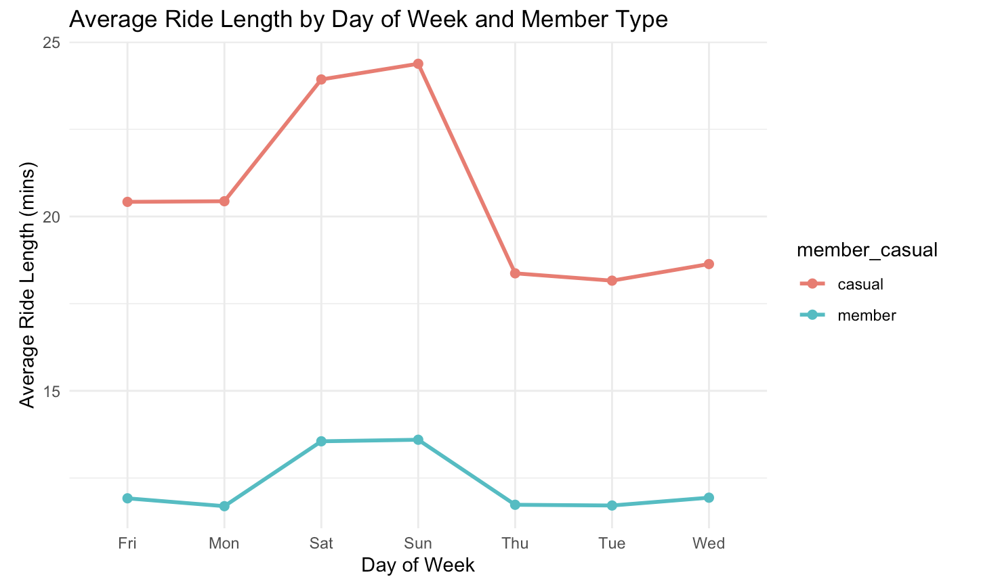

# Cyclistic Bike-Share Case Study

## Introduction
This repository contains the analysis and findings of the Cyclistic bike-share case study. The objective was to explore usage patterns between casual riders and annual members to design strategies for converting casual riders into annual members.

Cyclistic is a fictional bike-share company in Chicago with over 5,800 bicycles and 600 docking stations. This study is guided by the six phases of data analysis: **Ask, Prepare, Process, Analyze, Share, and Act.**

## Objective
The primary question addressed in this case study is: **How do annual members and casual riders use Cyclistic bikes differently?**

The insights derived are intended to:
1. Inform marketing strategies.
2. Increase annual memberships.
3. Provide actionable data-driven recommendations.

## Dataset
The analysis is based on **12 months of Cyclistic trip data**, including over 5.8 million records. The data contains information such as ride duration, user type (casual or member), and trip details. Sensitive customer information was excluded to ensure privacy.

### Data Sources
- [Cyclistic historical trip data](https://divvy-tripdata.s3.amazonaws.com/index.html)
- License: Provided by Motivate International Inc.

## Methodology
### Tools Used
- **Programming Language:** R
- **Libraries:** dplyr, ggplot2, lubridate, tidyr, skimr

### Steps
1. **Data Cleaning:** 
   - Handled missing values for station names and geolocations.
   - Created new variables: `ride_length` and `day_of_week`.
   - Filtered out invalid or incomplete data.

2. **Descriptive Analysis:**
   - Analyzed ride patterns by user type and time of year.
   - Calculated mean and maximum ride durations.

3. **Visualization:**
   - Created plots to illustrate trends (e.g., ride length by month and day).


4. **Export:**
   - Cleaned datasets and summaries exported for further analysis.

## Key Findings
1. **Usage Patterns:**
   - Casual riders have longer average ride durations than members, particularly on weekends.
   - Members primarily ride during weekdays, indicating a focus on commuting.

2. **Seasonal Trends:**
   - Summer months see a spike in ridership, especially among casual riders.

3. **Popular Days:**
   - Saturdays are the most popular day for casual riders.

### Recommendations
1. **Membership Campaigns:**
   - Target casual riders with promotions during weekends and summer months.
2. **Retention Strategies:**
   - Highlight cost benefits and commuting advantages to existing members.
3. **Enhanced Digital Marketing:**
   - Use data-driven campaigns to reach casual riders.

## Visualizations
Here are some visual insights from the study:

1. **Average Ride Length by Month:**
   

2. **Total Rides by Day and User Type:**
   

3. **Average Ride Length by Day:**
   

## How to Use
1. Clone this repository:
   ```bash
   git clone https://github.com/your-repository-url.git
   ```
2. Open the `Case_study1_clean.Rmd` file in RStudio.
3. Install necessary libraries:
   ```R
   install.packages(c("dplyr", "ggplot2", "lubridate", "readr"))
   ```
4. Knit the file to generate the report.

## Contribution
Contributions are welcome! Please open issues or submit pull requests for improvements.

## License
This project is licensed under the MIT License.

---

For detailed findings and analysis, refer to the [results document](./Case_Study1_results.pdf).
