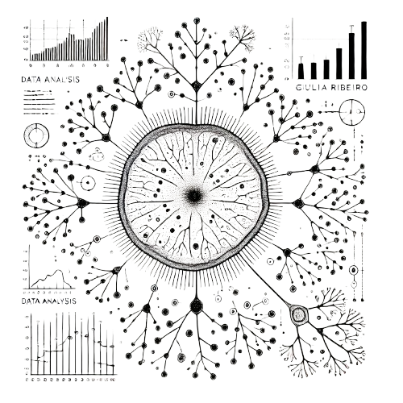

# Welcome to My GitHub Portfolio

## About Me
Hi, I’m **Giulia Magri Ribeiro**, a passionate and highly skilled bioinformatician with over 10 years of experience in molecular biology and next-generation sequencing (NGS) data analysis. I am currently a **Postdoctoral Researcher in Bioinformatics** at Lund University, where I focus on the genomics and epigenetics of _Mycobacterium avium_ strains, utilizing advanced NGS techniques.

  

### Transition to Data Analysis
While my background is rooted in bioinformatics and molecular biology, I am actively transitioning into a career in **data analysis**. My goal is to leverage my expertise in big data processing, programming, and statistical modeling to address challenges in diverse industries beyond academia.

### Academic Background
- **PhD in Sciences** and **Master’s in Sciences** from the University of São Paulo.
- International research experience at **Smith College (USA)** and **Real Jardín Botánico de Madrid (Spain)**.
- Ongoing studies in **Data Science** to enhance expertise in programming, machine learning, and statistical analysis.

## Expertise
- **High-throughput sequencing**: Genomics, transcriptomics, barcoding.
- **Data analysis**: Gene expression, phylogenomics, methylation analysis.
- **Programming & Computing**: Bash, Python, R, SLURM, HPC systems (e.g., UPPMAX).
- **Project Management**: Utilizing Nextflow for bioinformatics pipelines.
- **Molecular Biology Techniques**: DNA/RNA extraction, library preparation, genome assembly, phylogenetic analysis.

## Portfolio Highlights
### Bioinformatics Projects
- **Genomics & Epigenetics**: Pipelines for methylation and genome assembly analysis.
- **Environmental DNA Sequencing**: Microbial diversity exploration with Illumina and Nanopore data.
- **Phylogenomic Tools**: Workflows for phylogenetic and transcriptomic data.

### Contributions
- Development of **custom bioinformatics pipelines**.
- **Data visualization** for genomics insights.
- Research on **machine learning applications** in biological data.

## Get in Touch
I’m always excited to collaborate on projects merging biology and data science, as well as exploring opportunities in data analysis. Let’s connect!

- 🌐 [Website](https://giuliamagriribeiro.wordpress.com/)
- 💼 [LinkedIn](https://www.linkedin.com/in/giulia-magri-ribeiro-bioinformatician)
- 📧 [Email Me](mailto:giuliamagriribeiro@gmail.com)

---
Thank you for visiting my portfolio on GitHub!
